# 🏗️ M5GOTCHI PRO - ARCHITECTURE DOCUMENTATION

## 📐 System Architecture

### High-Level Architecture Diagram


### Module Dependency Graph


### Data Flow - Achievement System

```mermaid
sequenceDiagram
    participant User
    participant WiFiScanner
    participant AchievementMgr
    participant AchievementUI
    participant NekoSounds
    
    User->>WiFiScanner: Press SELECT to scan
    WiFiScanner->>WiFiScanner: Perform WiFi scan
    WiFiScanner->>AchievementMgr: onEvent(EVENT_WIFI_SCAN, 1)
    
    AchievementMgr->>AchievementMgr: updateStats()
    AchievementMgr->>AchievementMgr: checkAndUpdate()
    
    alt Achievement Unlocked
        AchievementMgr->>AchievementMgr: unlockAchievement(id)
        AchievementMgr->>AchievementMgr: updateCache()
        AchievementMgr-->>AchievementUI: hasNewUnlocks() = true
        
        AchievementUI->>AchievementMgr: getNewUnlocks()
        AchievementUI->>AchievementUI: showNotification()
        AchievementUI->>NekoSounds: playSound(SOUND_ACHIEVEMENT)
        
        NekoSounds-->>User: "Nya! Achievement! 🏆"
    end
```



### Memory Architecture


---

## 📦 Module Documentation

### 1. Core Systems

#### `main_cardputer.cpp`
- **Purpose**: Main application entry point
- **Responsibilities**:
  - Initialize all subsystems
  - Main loop coordination
  - Page navigation (4 pages)
  - Mode switching
- **Dependencies**: All modules
- **Memory**: ~10KB global variables

#### `m5gotchi_universal_controls.h`
- **Purpose**: Input abstraction layer
- **Responsibilities**:
  - Normalize input from M5Stack/Cardputer
  - Provide ACTION_ constants
  - Button debouncing
- **Dependencies**: M5Unified
- **Memory**: ~1KB

#### `m5gotchi_memory_utils.h` ⭐ NEW
- **Purpose**: Memory optimization utilities
- **Components**:
  - `MemoryMonitor`: Stats and alerts
  - `StringPool`: String deduplication
  - `ObjectPool<T>`: Generic object pooling
  - `CircularBuffer<T>`: Fixed-size FIFO
  - `DirtyFlag`: Optimization pattern
  - `SafeString`: Buffer overflow prevention
- **Memory Savings**: ~45KB RAM + reduced fragmentation

#### `m5gotchi_progmem_strings.h` ⭐ NEW
- **Purpose**: Centralized PROGMEM string library
- **Components**:
  - Common UI strings
  - Module-specific strings (WiFi, BLE, RFID, etc.)
  - Error messages
  - Help strings
  - Emoji library
  - Helper macros and utilities
- **Memory Savings**: ~14KB RAM → Flash

---

### 2. Achievement System v2.0 (Refactored) ⭐

#### `m5gotchi_achievement_manager.h`
**Purpose**: Achievement logic (NO UI CODE)

**Features**:
- Event-driven architecture
- O(1) event lookup via std::map
- Achievement caching for performance
- Persistence via Preferences
- Statistics tracking

**API**:
```cpp
// Inicializar
AchievementManager mgr;
mgr.init();

// Reportar evento
mgr.onEvent(EVENT_WIFI_SCAN);        // Incrementa 1
mgr.onEvent(EVENT_WIFI_HANDSHAKE, 5); // Incrementa 5

// Verificar novos unlocks
if (mgr.hasNewUnlocks()) {
    auto unlocked = mgr.getNewUnlocks();
    for (uint8_t id : unlocked) {
        const Achievement* ach = mgr.getAchievement(id);
        // Mostrar notificação
    }
}

// Queries
uint8_t count = mgr.countUnlocked();
float progress = mgr.getOverallProgress();
const PlayerStats& stats = mgr.getStats();

// Persistência
mgr.save();      // Manual save
mgr.update();    // Auto-save periódico
```

**Performance**:
- Event processing: O(1) lookup
- Achievement check: O(k) where k = achievements per event
- Cache hit: O(1)
- Cyclomatic Complexity: < 10 per function

**Memory**:
- Struct size: 16 bytes per achievement
- 50 achievements: 800 bytes
- Cache: 20 entries × 1 byte = 20 bytes
- Stats: 64 bytes

#### `m5gotchi_achievement_ui.h` (TODO)
**Purpose**: Achievement display (ONLY UI CODE)

**Responsibilities**:
- Render achievement lists
- Show notifications
- Progress bars
- Category filtering
- Detail views

**Separation of Concerns**:
```cpp
class AchievementUI {
    AchievementManager* manager; // Dependency injection
    
    void drawAchievementList() {
        const Achievement* achievements = manager->getAllAchievements();
        // Render UI...
    }
    
    void showNotification(uint8_t achId) {
        const Achievement* ach = manager->getAchievement(achId);
        // Display popup...
    }
};
```

---

### 3. Tutorial System ⭐ NEW

#### `m5gotchi_tutorial_system.h`
**Purpose**: First-time user onboarding and contextual help

**Features**:
- 9-step interactive wizard
- Contextual help (press ? key)
- Automatic hints on first visit
- Multi-language support (EN/PT-BR)
- Progress persistence
- Skip/Resume capability

**Flow**:


**API**:
```cpp
TutorialSystem tutorial;

void setup() {
    tutorial.init();
    
    if (tutorial.isFirstRun()) {
        tutorial.startWizard();
        while (tutorial.isTutorialActive()) {
            tutorial.update();
            // Handle input...
        }
    }
}

void loop() {
    // Em cada tela
    tutorial.setContext(CONTEXT_WIFI_SCANNER);
    
    // Mostrar ajuda ao pressionar ?
    if (buttonPressed('?')) {
        tutorial.showContextualHelp();
    }
    
    // Tooltips automáticos
    tutorial.update();  // Desenha tooltips se ativos
}
```

---

### 4. WiFi Tools

#### `m5gotchi_wifi_analyzer.h`
- **Purpose**: Scan and analyze WiFi networks
- **Features**: Channel analysis, vendor detection, RSSI graphing
- **Memory Optimization**: CircularBuffer for scan results (50 networks max)
- **Events**: EVENT_WIFI_SCAN

#### `m5gotchi_handshake_capture.h`
- **Purpose**: Capture WPA2 handshakes
- **Features**: Promiscuous mode, EAPOL filtering, PCAP export
- **Memory Optimization**: Streaming to SD, limited buffer
- **Events**: EVENT_WIFI_HANDSHAKE

#### `m5gotchi_deauth_attacker.h`
- **Purpose**: Deauthentication attacks
- **Features**: Target selection, continuous/burst modes
- **Memory Optimization**: Packet pooling
- **Events**: EVENT_WIFI_DEAUTH

#### `m5gotchi_evil_portal.h`
- **Purpose**: Captive portal phishing
- **Features**: 4+ portal templates, credential logging
- **Memory Optimization**: Templates in PROGMEM/SPIFFS
- **Events**: EVENT_PORTAL_CREATE

---

### 5. RFID/NFC Tools ⭐ NEW

#### `m5gotchi_rfid_nfc.h`
- **Purpose**: Multi-protocol RFID/NFC operations
- **Hardware**: PN532, RC522, RDM6300
- **Features**:
  - Scanner (HF 13.56MHz + LF 125kHz)
  - Reader (Mifare Classic/Ultralight/NTAG)
  - Writer with dump support
  - Cloner (3-step process)
  - Analyzer (card detection, features)
  - Attacks (Dictionary, Darkside, Nested)
  - Key database (default + custom)
- **Memory**: 10 saved cards max, circular buffer for keys
- **Events**: EVENT_RFID_SCAN, EVENT_RFID_CLONE

#### `m5gotchi_chameleon_ultra.h` ⭐ NEW
- **Purpose**: Interface with Chameleon Ultra
- **Connection**: Serial UART / BLE
- **Features**:
  - 8 HF slots + 8 LF slots
  - Emulator mode
  - Mifare attacks integration
  - Battery monitor
  - Settings sync
- **Events**: EVENT_RFID_CLONE (quando clona para Chameleon)

---

### 6. Kawaii Features

#### `m5gotchi_neko_virtual_pet.h`
- **Purpose**: Tamagotchi-style companion
- **Features**: 6 evolution stages, needs system, reactions
- **Integration**: Reacts to hacking activities
- **Memory**: Pet state (~200 bytes)

#### `m5gotchi_nekogram_chat.h`
- **Purpose**: P2P secure messaging
- **Protocol**: ESP-NOW + AES-256
- **Features**: Direct messages, groups, stickers
- **Memory**: Message queue (CircularBuffer)

#### `m5gotchi_kawaii_social.h`
- **Purpose**: Social network for discoveries
- **Features**: Feed, profiles, leaderboards
- **Storage**: SD card JSON
- **Events**: EVENT_FRIEND_ADD

#### `m5gotchi_neko_sounds.h`
- **Purpose**: Audio feedback system
- **Features**: 7 personalities, 10 sound types
- **Memory**: Melody data in PROGMEM
- **Events**: EVENT_SOUND_PLAY

---

## 🔄 State Machines

### Main Application State

```mermaid
stateDiagram-v2
    [*] --> Boot
    Boot --> Tutorial: First Run
    Boot --> MainMenu: Returning
    
    Tutorial --> MainMenu: Complete
    
    state MainMenu {
        [*] --> Page1_Pentest
        Page1_Pentest --> Page2_Advanced: →
        Page2_Advanced --> Page3_Games: →
        Page3_Games --> Page4_Kawaii: →
        Page4_Kawaii --> Page1_Pentest: →
        
        Page1_Pentest --> Page4_Kawaii: ←
    }
    
    MainMenu --> Module: SELECT
    Module --> MainMenu: BACK
    
    state Module {
        [*] --> Init
        Init --> Running
        Running --> [*]
    }
```



### Achievement Unlock Flow


---

## 💾 Data Persistence

### Storage Strategy

| Data Type | Storage | Format | Frequency |
|-----------|---------|--------|-----------|
| Achievements Progress | Preferences | Binary | Every 5min or on event |
| Player Stats | Preferences | Binary | With achievements |
| Tutorial Progress | Preferences | Binary | After each step |
| WiFi Scans | SD Card | CSV/JSON | On demand |
| Handshakes | SD Card | PCAP | Real-time stream |
| RFID Dumps | SD Card | BIN/JSON | On save |
| Settings | Preferences | Key-Value | On change |
| Logs | SD Card | TXT | Batched |

### Preferences Namespaces

```cpp
"m5gotchi_tut"  // Tutorial system
"m5g_achv"      // Achievements
"m5g_settings"  // General settings
"m5g_pet"       // Virtual pet state
"m5g_wifi"      // WiFi module state
"m5g_rfid"      // RFID saved cards
```

---

## 🎯 Performance Metrics

### Target Performance

| Metric | Target | Current | Status |
|--------|--------|---------|--------|
| Boot Time | < 3s | ~2.5s | ✅ |
| WiFi Scan | < 5s | ~3s | ✅ |
| Screen Redraw | 60 FPS | ~50 FPS | ⚠️ |
| Achievement Check | < 1ms | ~0.5ms | ✅ |
| Memory Usage | < 70% | ~50% | ✅ |
| Heap Fragmentation | < 30% | ~25% | ✅ |

### Optimization Techniques Applied

1. **PROGMEM**: ~14KB RAM saved
2. **Object Pooling**: -10KB + less fragmentation
3. **CircularBuffer**: Prevents unbounded growth
4. **Event Map**: O(n) → O(1) achievement checks
5. **Caching**: Frequently accessed data
6. **Dirty Flags**: Skip unnecessary redraws
7. **String Pooling**: Deduplicate common strings

---

## 🧪 Testing Strategy (TODO)

### Unit Tests Framework
```cpp
// test/test_achievement_manager.cpp
#include <unity.h>
#include "m5gotchi_achievement_manager.h"

void test_event_triggers_achievement() {
    AchievementManager mgr;
    mgr.init();
    
    uint8_t unlocked = mgr.onEvent(EVENT_WIFI_SCAN);
    TEST_ASSERT_EQUAL(1, unlocked);
    TEST_ASSERT_TRUE(mgr.getAchievement(0)->isUnlocked());
}

void test_progress_tracking() {
    AchievementManager mgr;
    mgr.init();
    
    for (int i = 0; i < 49; i++) {
        mgr.onEvent(EVENT_WIFI_SCAN);
    }
    TEST_ASSERT_FALSE(mgr.getAchievement(1)->isUnlocked());
    
    mgr.onEvent(EVENT_WIFI_SCAN); // 50th
    TEST_ASSERT_TRUE(mgr.getAchievement(1)->isUnlocked());
}
```

---

## 📚 API Reference

See individual module headers for detailed Doxygen documentation.

### Quick Reference

```cpp
// Memory Utils
MemoryMonitor::printStats();
StringPool::get("message");
ObjectPool<T> pool(size);
CircularBuffer<T, SIZE> buffer;
DirtyFlag dirty;

// PROGMEM Strings
PRINT_P(WiFiStrings::TITLE_SCANNER);
String msg = PSTR_TO_STRING(CommonStrings::MSG_SUCCESS);

// Achievement Manager
mgr.onEvent(EVENT_WIFI_SCAN);
mgr.hasNewUnlocks();
mgr.getNewUnlocks();
mgr.save();

// Tutorial System
tutorial.init();
tutorial.startWizard();
tutorial.setContext(CONTEXT_WIFI_SCANNER);
tutorial.showContextualHelp();
```

---

**Last Updated**: 2025-10-26  
**Version**: 2.0  
**Architecture Status**: 🟢 Stable (Refactored)
